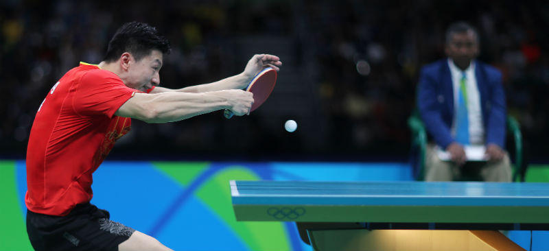
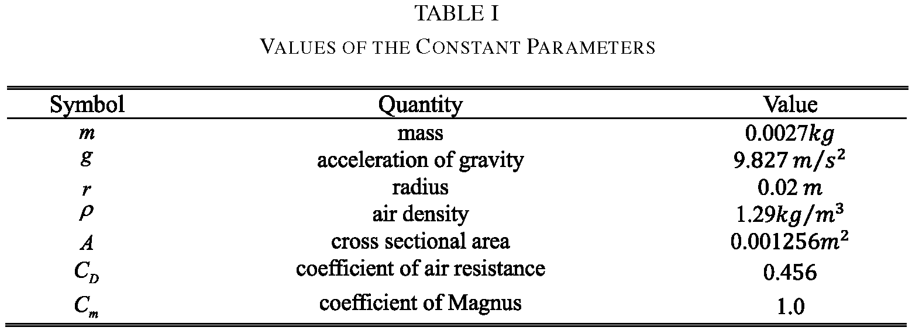
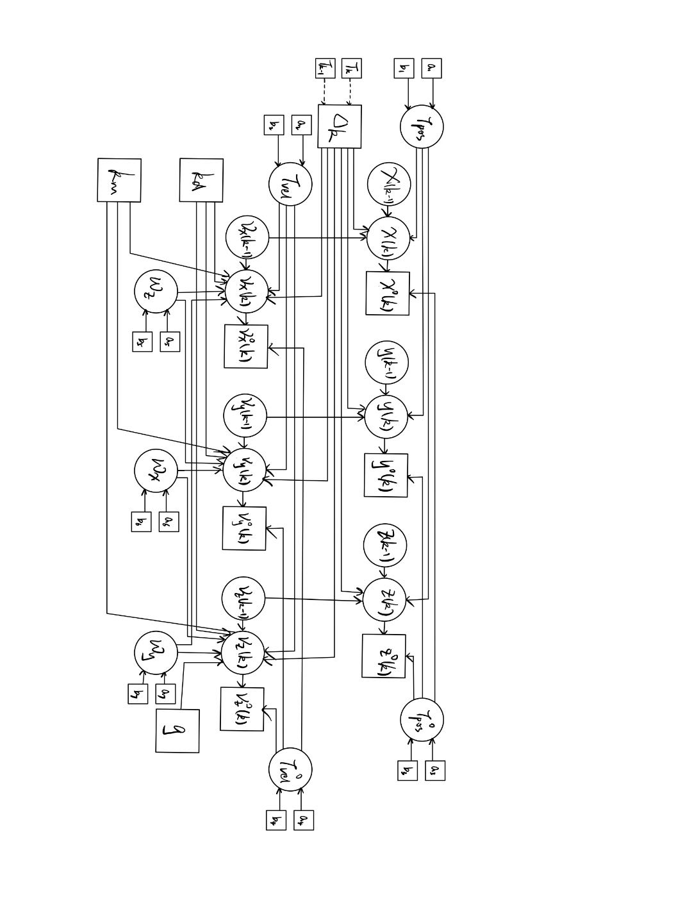

---
editor_options:
  markdown:
    wrap: 72
output: pdf_document
---

**University of Edinburgh**

**School of Mathematics**

**Bayesian Data Analysis, 2023/2024, Semester 2**

**Assignment 1**

**IMPORTANT INFORMATION ABOUT THE ASSIGNMENT**

**In this paragraph, we summarize the essential information about this
assignment. The format and rules for this assignment are different from
your other courses, so please pay attention.**

**1) Deadline: The deadline for submitting your solutions to this
assignment is 1 March 12:00 noon Edinburgh time.**

**2) Format: You will need to submit your work as 2 components: a PDF
report, and your R Markdown (.Rmd) notebook (this can be in a zip file
if you include additional images). There will be two separate submission
systems on Learn: Gradescope for the report in PDF format, and a Learn
assignment for the code in Rmd format. You need to write your solutions
into this R Markdown notebook (code in R chunks and explanations in
Markdown chunks), and then select Knit/Knit to PDF in RStudio to create
a PDF report.**

{width="192"}

**The compiled PDF needs to contain everything in this notebook, with
your code sections clearly visible (not hidden), and the output of your
code included. Reports without the code displayed in the PDF, or without
the output of your code included in the PDF will be marked as 0, with
the only feedback "Report did not meet submission requirements".**

**You need to upload this PDF in Gradescope submission system, and your
Rmd file in the Learn assignment submission system. You will be required
to tag every sub question on Gradescope.**

**Some key points that are different from other courses:**

**a) Your report needs to contain written explanation for each question
that you solve, and some numbers or plots showing your results.
Solutions without written explanation that clearly demonstrates that you
understand what you are doing will be marked as 0 irrespectively whether
the numerics are correct or not.**

**b) Your code has to be possible to run for all questions by the Run
All in RStudio, and reproduce all of the numerics and plots in your
report (up to some small randomness due to stochasticity of Monte Carlo
simulations). The parts of the report that contain material that is not
reproduced by the code will not be marked (i.e. the score will be 0),
and the only feedback in this case will be that the results are not
reproducible from the code.**

{width="375"}

**c) Multiple Submissions are allowed BEFORE THE DEADLINE are allowed
for both the report, and the code.\
However, multiple submissions are NOT ALLOWED AFTER THE DEADLINE.\
YOU WILL NOT BE ABLE TO MAKE ANY CHANGES TO YOUR SUBMISSION AFTER THE
DEADLINE.\
Nevertheless, if you did not submit anything before the deadline, then
you can still submit your work after the deadline, but late penalties
will apply. The timing of the late penalties will be determined by the
time you have submitted BOTH the report, and the code (i.e. whichever
was submitted later counts).**

**We illustrate these rules by some examples:**

**Alice has spent a lot of time and effort on her assignment for BDA.
Unfortunately she has accidentally introduced a typo in her code in the
first question, and it did not run using Run All in RStudio. - Alice
will get 0 for the part of the assignments that do not run, with the
only feedback "Results are not reproducible from the code".**

**Bob has spent a lot of time and effort on his assignment for BDA.
Unfortunately he forgot to submit his code. He will get one reminder to
submit his code. If he does not do it, Bob will get 0 for the whole
assignment, with the only feedback "Results are not reproducible from
the code, as the code was not submitted."**

**Charles has spent a lot of time and effort on his assignment for BDA.
He has submitted both his code and report in the correct formats.
However, he did not include any explanations in the report. Charles will
get 0 for the whole assignment, with the only feedback "Explanation is
missing."**

**3) Group work: This is an INDIVIDUAL ASSIGNMENT. You can talk to your
classmates to clarify questions, but you have to do your work
individually and cannot copy parts from other students. Students who
submit work that has not been done individually will be reported for
Academic Misconduct, which can lead to severe consequences. Each
question will be marked by a single instructor, and submissions will be
compared by advanced software tools, so we will be able to spot students
who copy.**

**4) Piazza: During the assignments, the instructor will change Piazza
to allow messaging the instructors only, i.e. students will not see each
others messages and replies.**

**Only questions regarding clarification of the statement of the
problems will be answered by the instructors. The instructors will not
give you any information related to the solution of the problems, such
questions will be simply answered as "This is not about the statement of
the problem so we cannot answer your question."**

**THE INSTRUCTORS ARE NOT GOING TO DEBUG YOUR CODE, AND YOU ARE ASSESSED
ON YOUR ABILITY TO RESOLVE ANY CODING OR TECHNICAL DIFFICULTIES THAT YOU
ENCOUNTER ON YOUR OWN.**

**5) Office hours: There will be one office hour per week (Wednesdays
16:00-17:00) during the 2 weeks for this assignment. This is in JCMB
5413. I will be happy to discuss the course/workshop materials. However,
I will only answer questions about the assignment that require
clarifying the statement of the problems, and will not give you any
information about the solutions.**

**6) Late submissions and extensions: UP TO A MAXIMUM OF 3 CALENDAR DAYS
EXTENSION IS ALLOWED FOR THIS ASSIGNMENT IN THE ESC SYSTEM. You need to
apply before the deadline.**

**If you submit your solutions on Learn before the deadline, the system
will not allow you to update it even if you have received an extension.
There is only 1 submission allowed after the deadline.**

**Students who have existing Learning Adjustments in Euclid will be
allowed to have the same adjustments applied to this course as well, but
they need to apply for this BEFORE THE DEADLINE on the website.**

[**https://www.ed.ac.uk/student-administration/extensions-special-circumstances**](https://www.ed.ac.uk/student-administration/extensions-special-circumstances){.uri}

**by clicking on "Access your learning adjustment". This will be
approved automatically.**

**Students who submit their work late will have late submission
penalties applied by the ESC team automatically (this means that even if
you are 1 second late because of your internet connection was slow, the
penalties will still apply). The penalties are 5% of the total mark
deduced for every day of delay started (i.e. one minute of delay counts
for 1 day). The course instructors do not have any role in setting these
penalties, we will not be able to change them.**

```{r}
rm(list=ls(all=TRUE))
#Do not delete this!
#It clears all variables to ensure reproducibility
```



**Ping-pong, or table tennis, is a popular sport around the world. In
this assignment, we will apply Bayesian modelling to the movement of a
ping-pong ball.**

**As explained in the paper "Optimal State Estimation of Spinning
Ping-Pong Ball Using Continuous Motion Model" by Zhao et al., the
physical equations describing the movement of a spinning ball in air
without wind can be described as**
$$\frac{d V}{d t}=k_d \|V\|V+k_m \omega\times V+g,$$ **where** $V$ **is
the velocity of the ball (3-dimensional vector),** $\omega$ **is the
angular velocity (3-dimensional vector),** $g$ **is the local gravity
acceleration (3-dimensional vector),** $\times$ **refers to the cross
product [<https://en.wikipedia.org/wiki/Cross_product>]. The constants**
$k_d$ **and** $k_m$ **are expressed as** $$
\begin{split}
k_d&:=-\frac{1}{2m}C_D \rho A \\
k_m&:=\frac{1}{2m}C_m \rho A r. 
\end{split}
$$ **The meaning and values of the parameters here are shown in the
following table. **

**We observe positions and velocities at times**
$T_1, T_2,\ldots, T_n$**, and define** $\Delta_k=T_{k+1}-T_k$**. The
simplest way to discretize this ODE is as follows(Euler-Mayurama
discretization of the original ODE, see equation (2) of "Optimal State
Estimation of Spinning Ping-Pong Ball Using Continuous Motion Model"),**

$$
\left[\begin{matrix}x(k+1)\\ y(k+1) \\ z(k+1) \\ v_x(k+1) \\ v_y(k+1) \\ v_z(k+1)\end{matrix}\right]=
\left[\begin{matrix}x(k)\\ y(k) \\ z(k) \\ v_x(k) \\ v_y(k) \\ v_z(k)\end{matrix}\right]+\left[\begin{matrix}v_x(k)\\ v_y(k) \\ v_z(k) \\ k_d \|V(k)\|v_x(k)+k_m(\omega_y v_z(k)-\omega_z v_y(k)) \\ k_d \|V(k)\|v_y(k)+k_m(\omega_z v_x(k)-\omega_x v_z(k)) \\ k_d \|V(k)\|v_z(k)+k_m(\omega_x v_y(k)-\omega_y v_x(k))-g\end{matrix}\right]\cdot \Delta_k,
$$ **where** $\|V(k)\|=\sqrt{v_x(k)^2+v_y(k)^2+v_z(k)^2}$ **is the
magnitude of velocity at time** $T_k$**.**

**In this question, we are going to assume a similar model, but with
additional Gaussian model noise, and also assume that the position and
velocity observations are also subject to observation noise. Hence, our
model equations are as follows,**$$
\left[\begin{matrix}x(k+1)\\ y(k+1) \\ z(k+1) \\ v_x(k+1) \\ v_y(k+1) \\ v_z(k+1)\end{matrix}\right]\sim N\left[
\left[\begin{matrix}x(k)\\ y(k) \\ z(k) \\ v_x(k) \\ v_y(k) \\ v_z(k)\end{matrix}\right]+\left[\begin{matrix}v_x(k)\\ v_y(k) \\ v_z(k) \\ k_d \|V(k)\|v_x(k)+k_m(\omega_y v_z(k)-\omega_z v_y(k)) \\ k_d \|V(k)\|v_y(k)+k_m(\omega_z v_x(k)-\omega_x v_z(k)) \\ k_d \|V(k)\|v_z(k)+k_m(\omega_x v_y(k)-\omega_y v_x(k))-g\end{matrix}\right]\cdot \Delta_k,\Sigma\right],
$$

**where**
$\Sigma=Diag[\tau_{pos}^{-1},\tau_{pos}^{-1},\tau_{pos}^{-1},\tau_{vel}^{-1},\tau_{vel}^{-1},\tau_{vel}^{-1}]$
**is a diagonal covariance matrix depending on parameters** $\tau_{pos}$
**and** $\tau_{vel}$**.**

**The observation model is the following,**$$
\left[\begin{matrix}x^o(k)\\ y^o(k) \\ z^o(k) \\ v_x^o(k) \\ v_y^o(k) \\ v_z^o(k)\end{matrix}\right]\sim N\left[
\left[\begin{matrix}x(k)\\ y(k) \\ z(k) \\ v_x(k) \\ v_y(k) \\ v_z(k)\end{matrix}\right],\Sigma^{o}\right],
$$

**where**
$\Sigma^o=Diag[(\tau_{pos}^o)^{-1},(\tau_{pos}^o)^{-1},(\tau_{pos}^o)^{-1},(\tau_{vel}^o)^{-1},(\tau_{vel}^o)^{-1},(\tau_{vel}^o)^{-1}]$

**Q1) [10 marks]**

**a) [5 marks] Draw a DAG representation of this model (this can be done
on a tablet, or draw it on a piece of paper and then take a picture or
scan). Images can be included in R Markdown, as explained in
[<https://www.earthdatascience.org/courses/earth-analytics/document-your-science/add-images-to-rmarkdown-report/>].**



**b) [5 marks] For the initial values, choose priors of the
form**$x(1)\sim N(0,1), y(1)\sim N(0, 1), z(1)\sim N(0,1)$,
$v_x(1)\sim N(0,25), v_y(1)\sim N(0,25), v_z(1)\sim N(0,25).$**Choose
your own priors for** $\tau_{pos}$**,** $\tau_{vel}$**,**
$\tau_{pos}^{o}$**,** $\tau_{vel}^{o}$ **,** $\omega_{x}$**,**
$\omega_{y}$**,** $\omega_z$**. Explain your choices.**

**If you use informative priors, please cite the source of the
information you used precisely (i.e. web link, or precise page number in
a paper. Saying Google search said " " will not suffice).**

-   $\omega_x$, $\omega_y$, $\omega_z$: For angular velocities of the
    three dimensions, since we have little information about the
    launching details and the angular velocity and direction of the
    ball, we choose uninformative normal distributions for modelling,
    which is a proper consideration under this randomized situation, and
    set the means as $0$. In addition, since the measured ball spins
    among players on national team level which used maximum strength to
    hit a defined target is $113.9s^{-1}$ [1], we set the standard
    deviations as reasonably high values, $100$, i.e.
    $\omega_x\sim N(0, 100^2)$, $\omega_y\sim N(0, 100^2)$, and
    $\omega_z\sim N(0, 100^2)$, to ensure the dataset can have a greater
    impact on the estimation than the priors.

-   $\tau_{pos}$, $\tau_{vel}$, $\tau_{pos}^o$, $\tau_{vel}^o$: we set
    gamma priors to the precisions. However, given that the maximum
    speed of AIMY's precise launch is $15.4m\cdot s^{-1}$ [1], and the
    commonsense that the outside environmental force will not have a
    considerable impact on the velocity relatively, we believe that
    under the experimental settings, the velocity fluctuation should
    generally not drop out of $\pm 5$ interval. Therefore, we choose $1$
    and $0.1$ for the shape and scale parameters, respectively (making
    the mean precision $\mu_{\tau}=\alpha\beta=0.1$, in a reasonable
    scale and mass not too concentrated), i.e.
    $\tau_{pos}\sim \gamma(1, 0.1)$, $\tau_{vel}\sim \gamma(1, 0.1)$,
    $\tau_{pos}^o\sim \gamma(1, 0.1)$,
    $\tau_{vel}^o\sim \gamma(1, 0.1)$.

**References**

[1] Dittrich, A., Schneider, J., Guist, S., Gurtler, N., Ott, H.,
Steinbrenner, T., ... & Buchler, D. (2023, May). AIMY: An open-source
table tennis ball launcher for versatile and high-fidelity trajectory
generation. In 2023 IEEE International Conference on Robotics and
Automation (ICRA) (pp. 3058-3064). IEEE. (paragraph 4, page 1)

**Q2) [10 marks] In this question, we are going to fit the model of Q1)
on a real dataset from [Table Tennis Ball Trajectories with Spin -
Edmond (mpg.de)]. In this dataset, there are many recorded trajectories
of ping-pong balls shot out by a table tennis launcher robot. We will
only use one trajectory here.**

**First, we load the dataset, and show a 3D plot of the trajectory.**

```{r}
# If you do not have BiocManager and rhdf5 packages installed, you need to install these first. 
# install.packages("BiocManager")
# BiocManager::install("rhdf5")
library(rhdf5)
# This command lists all the information in this dataset.
# Please do not include it in the knitted PDF, as it takes 20+ pages
# h5ls("MN5008_grid_data_equal_speeds.hdf5",)
n <- 60;

xyz.obs <- h5read("MN5008_grid_data_equal_speeds.hdf5", "/originals/405/positions")[, 2: (n + 1)];
# Read positions of simulation number 405
xo <- xyz.obs[1, ];
yo <- xyz.obs[2, ];
zo <- xyz.obs[3, ];

vxvyvz.obs <- h5read("MN5008_grid_data_equal_speeds.hdf5", "/originals/405/velocities")[, 2: (n + 1)];
#Read velocities of simulation number 405
vxo <- vxvyvz.obs[1, ];
vyo <- vxvyvz.obs[2, ];
vzo <- vxvyvz.obs[3, ];

T <- h5read("MN5008_grid_data_equal_speeds.hdf5", "/originals/405/time_stamps")[2: (n + 1)];
#Read time points of observations

library(rgl)
rgl_init <- function(new.device=FALSE, bg="white", width=640) {
  if(new.device | rgl.cur() == 0) {
    open3d()
    par3d(windowRect=50 + c(0, 0, width, width))
    bg3d(color=bg)
  }
  clear3d(type=c("shapes", "bboxdeco"))
  view3d(theta=15, phi=20, zoom=0.7)
}

rgl_init()
spheres3d(xo, yo, zo, r=0.05, color="yellow")  # Scatter plot
bbox3d(color="#333377")
```

**Implement the model explained in Q1) in JAGS or STAN, with the data
here referring to the observations**
$x^{o},y^{o}, z^{o}, v_x^{o}, v_y^{o},v_z^{o}$**.**

**Please treat** $k_m$ **and** $k_d$ **as fixed constants that can be
computed based on the equations in Q1).**

**Evaluate the Gelman-Rubin diagnostics for model parameters**
$\tau_{pos}$**,** $\tau_{vel}$**,** $\tau_{pos}^{o}$**,**
$\tau_{vel}^{o}$ **,** $\omega_{x}$**,** $\omega_{y}$**,** $\omega_z$**,
as well as their effective sample sizes. Choose the burn-in period,
number of chains, and number of iterations such that the effective
sample size is at least 1000 in all of these parameters.**

**Include the summary statistics from these parameters. Discuss the
results.**

**Plot the posterior density of the angular velocity parameters
(**$\omega_{x}$**,** $\omega_{y}$**,** $\omega_z$**). Discuss the
results.**

```{r}
library(rjags)

# jags model string
model_string <- "
model {
  tau.p ~ dgamma(a.tau, b.tau)
  tau.po ~ dgamma(a.tau, b.tau)
  tau.v ~ dgamma(a.tau, b.tau)
  tau.vo ~ dgamma(a.tau, b.tau)
  
  x[1] ~ dnorm(mup1, taup1)
  y[1] ~ dnorm(mup1, taup1)
  z[1] ~ dnorm(mup1, taup1)
  vx[1] ~ dnorm(muv1, tauv1)
  vy[1] ~ dnorm(muv1, tauv1)
  vz[1] ~ dnorm(muv1, tauv1)
  
  wx ~ dnorm(muw, tauw)
  wy ~ dnorm(muw, tauw)
  wz ~ dnorm(muw, tauw)
  
  for (i in 1: (n - 1)) {
    delta[i] = t[i + 1] - t[i]
    V[i] = sqrt(vx[i] ** 2 + vy[i] ** 2 + vz[i] ** 2)
    x[i + 1] ~ dnorm(x[i] + delta[i] * vx[i], tau.p)
    y[i + 1] ~ dnorm(y[i] + delta[i] * vy[i], tau.p)
    z[i + 1] ~ dnorm(z[i] + delta[i] * vz[i], tau.p)
    vx[i + 1] ~ dnorm(vx[i] +
                      delta[i] * (kd * V[i] * vx[i] + km * (wy * vz[i] - wz * vy[i])), tau.v)
    vy[i + 1] ~ dnorm(vy[i] +
                      delta[i] * (kd * V[i] * vy[i] + km * (wz * vx[i] - wx * vz[i])), tau.v)
    vz[i + 1] ~ dnorm(vz[i] +
                      delta[i] * (kd * V[i] * vz[i] + km * (wx * vy[i] - wy * vx[i]) - g), tau.v)
  }
  
  for (i in 1: n) {
    x.o[i] ~ dnorm(x[i], tau.po)
    y.o[i] ~ dnorm(y[i], tau.po)
    z.o[i] ~ dnorm(z[i], tau.po)
    vx.o[i] ~ dnorm(vx[i], tau.vo)
    vy.o[i] ~ dnorm(vy[i], tau.vo)
    vz.o[i] ~ dnorm(vz[i], tau.vo)
    
    xrep.o[i] ~ dnorm(x[i], tau.po)
    yrep.o[i] ~ dnorm(y[i], tau.po)
    zrep.o[i] ~ dnorm(z[i], tau.po)
    vxrep.o[i] ~ dnorm(vx[i], tau.vo)
    vyrep.o[i] ~ dnorm(vy[i], tau.vo)
    vzrep.o[i] ~ dnorm(vz[i], tau.vo)
  }
  
}
"

# defining constants, hyperparameters, and model running parameters
m <- 0.0027; g <- 9.827; r <- 0.02; rho <- 1.29
A <- 0.001256; CD <- 0.456; Cm <- 1.0
kd <- - CD * rho * A / (2 * m)
km <- Cm * rho * A * r / (2 * m)

mup1 <- 0; taup1 <- 1; muv1 <- 0; tauv1 <- 0.04
at <- 1; bt <- 0.1; muw <- 0; tauw <- 1e-4

num.chains <- 3

# defining the data to be fed in
data <- list(x.o=xo, y.o=yo, z.o=zo, vx.o=vxo, vy.o=vyo, vz.o=vzo, t=T, n=n,
             a.tau=at, b.tau=bt, muw=muw, tauw=tauw,
             mup1=mup1, taup1=taup1, muv1=muv1, tauv1=tauv1,
             kd=kd, km=km, g=g
             )

# running the jags model
model <- jags.model(textConnection(model_string), data=data, n.chains=num.chains)
```

```{r}
# burn-in phase
update(model, n.iter=1000, progress.bar="none")
# sampling process
res <- coda.samples(model, n.iter=30000,
                    variable.names=c("tau.p", "tau.v", "tau.po", "tau.vo", "wx", "wy", "wz"),
                    progress.bar="none")
```

```{r}
# some summary statistics
summary(res)
gelman.diag(res)
effectiveSize(res[[1]])
```

```{r}
# Gelman-Rubin plots
par(mfrow=c(3, 3))
par(mar=c(2, 2, 2, 2))
gelman.plot(res)
```

```{r}
# retrieving samples of omegas and plot
res.mat <- as.matrix(res)
par(mfrow=c(3, 1))
par(mar=c(2, 2, 2, 2))
plot(density(res.mat[, 5]), main="Posterior density of the x-dimension angular velocity omega_x")
plot(density(res.mat[, 6]), main="Posterior density of the y-dimension angular velocity omega_y")
plot(density(res.mat[, 7]), main="Posterior density of the z-dimension angular velocity omega_z")
```

Explanation: (Write your explanation here)

**Note that all the result numbers recorded in the explanation are from
a single "Run All" of the notebook. Since the knitting process will
rerun the whole notebook again, the values in the explanation may differ
from the output displayed (up to some small randomness).**

We choose chain number $3$, burn-in step $1000$, and sample iteration
$30000$ to ensure good mixing of the sample results (`plot(res)` can be
the checking code, which is omitted here since undemanded). From the
summary statistics we can see that the posterior mean estimates of
$\tau_{pos}$ ($423.7460$)**,** $\tau_{vel}$ ($85.9849$)**,**
$\tau_{pos}^{o}$($480.1612$)**, and** $\tau_{vel}^{o}$ ($4.8880$), i.e.
$\sigma_{pos}$ ($0.04858$)**,** $\sigma_{vel}$ ($0.1078$)**,**
$\sigma_{pos}^{o}$($0.04564$)**, and** $\sigma_{vel}^{o}$ ($0.4523$),
implies a larger uncertainty in velocities than positions, given their
similar scales (as we can see from the data).

Combining the posterior distribution plots of the $\omega$s, we can see
that the posterior means of $\omega_{x}$ ($-3.8221$) and $\omega_z$
($-0.8516$) implies a relatively slower spin regarding the x and z
coordinates than the y coordinate, comparing to $\omega_{y}$
($15.1637$), i.e. the spin direction of the ball most likely incline
more to the y coordinate. However, the standard deviations and
coefficients of variation of the angular velocities are much larger,
implying greater uncertainties, which is reasonable since we have only
one trajectory data and a very uncertain priori.

We also implemented $3$ chains to evaluate the Gelman-Rubin diagnostics,
with which of all monitored parameters equal to $1$, implying the
within-chain variability and the between-chain variability are the same,
i.e. there is no or ignorable variation between the $3$ chains. The
Gelman-Rubin plots also demonstrate good convergence.

The entire set of parameters are chosen so that the effective sizes of
the monitored variables are all greater than $1000$, with most of them
even greater than $10000$. This demonstrates a low correlation between
samples, ensuring the effectiveness of our sampling. Note that here we
choose to calculate the within-chain effective size, which is more
meaningful regardless of the number of chains.

**Q3)[10 marks] Perform posterior predictive checks on the model in Q2).
Explain your choices of test functions, and interpret the results.**

-   Posterior predictive checks

    ```{r}
    # sampling process of the replicate data
    res.rep <- coda.samples(model, n.iter=30000,
                            variable.names=c("xrep.o", "yrep.o", "zrep.o",
                                             "vxrep.o", "vyrep.o", "vzrep.o"),
                            progress.bar="none")

    res.rep <- as.matrix(res.rep)

    # retrieving the corresponding samples
    vxres.rep <- res.rep[, 1: n]
    vyres.rep <- res.rep[, 1: n + n]
    vzres.rep <- res.rep[, 1: n + 2 * n]
    xres.rep <- res.rep[, 1: n + 3 * n]
    yres.rep <- res.rep[, 1: n + 4 * n]
    zres.rep <- res.rep[, 1: n + 5 * n]

    require(fBasics)

    # function for replicate data checks, calculating the five statistics and plot
    repanalysis <- function(res.ori, res.rep, str) {
      # res.ori: the original data from the real world
      # res,rep: the replicate data from the model
      
      # calculating the five statistics of the replicate data
      rep.min <- apply(res.rep, 1, min)
      rep.max <- apply(res.rep, 1, max)
      rep.med <- apply(res.rep, 1, median)
      rep.kurt <- apply(res.rep, 1, kurtosis)
      rep.skew <- apply(res.rep, 1, skewness)
      
      # plotting the original data statistics and replicate data statistics
      hist(rep.min, col="gray40", main=paste("min of", str))
      abline(v=min(res.ori), col="red", lwd=2)
      hist(rep.max, col="gray40", main=paste("max of", str))
      abline(v=max(res.ori), col="red", lwd=2)
      hist(rep.med, col="gray40",main=paste("median of", str))
      abline(v=median(res.ori), col="red", lwd=2)
      hist(rep.kurt, col="gray40", main=paste("kirtosis of", str))
      abline(v=kurtosis(res.ori), col="red", lwd=2)
      hist(rep.skew, col="gray40", main=paste("skewness of", str))
      abline(v=skewness(res.ori), col="red", lwd=2)
    }
    ```

    ```{r}
    # posterior predictive checks for xo, yo, zo
    par(mfrow=c(5, 3))
    par(mar=c(2, 2, 2, 2))
    repanalysis(xo, xres.rep, "xo")
    repanalysis(yo, yres.rep, "yo")
    repanalysis(zo, zres.rep, "zo")
    ```

    ```{r}
    # posterior predictive checks for vxo, vyo, vzo
    par(mfrow=c(5, 3))
    par(mar=c(2, 2, 2, 2))
    repanalysis(vxo, vxres.rep, "vxo")
    repanalysis(vyo, vyres.rep, "vyo")
    repanalysis(vzo, vzres.rep, "vzo")
    ```

-   DIC

    ```{r}
    # DIC check
    dic.samples(model, n.iter=10000)
    ```

Discussion 1:

First, we do posterior predictive checks on the observed data, which
means reproducing the data based on our model and comparing the relative
statistics of the replicated and original data, thus checking the
reasonability of our model. Here, we choose minimum, maximum, median,
kurtosis, and skewness as the comparison statistics. From the plots, we
can see that the median, skewness, and kurtosis of thier posterior
distributions generally meet those of the real-world data. Regarding
minimum and maximum, the velocities and positions of the $x$ coordinate
fit well, but not for the $y$ and $z$ coordinates. This implies that we
might get a better model if we separate the priors of the noise
parameters of the three coordinates since the variations are likely to
be different.

Apart from the demanded check, we also do a DIC (Deviance Information
Criterion) check on the model. The result ($-354.5$) is a reasonably
small value, which likely indicates a fairly good model, but we still
need to compare it with other model's DIC to ensure this.

**Do a plot of the** $x$ **coordinate of the trajectory against the**
$z$ **coordinate, and include at least 100 of the posterior replicates
on the same plot (see Line 351 in the code of Lecture 3 for a similar
plot).** **Discuss the results.**

```{r}
# plot as desired
plot(zres.rep[1, ], xres.rep[1, ], col="lightskyblue1",
     xlab="z coordinate", ylab="x coordinate",
     xlim=c(0.8, 1.6), ylim=c(1.4, 3.1))
for(i in 2: 1000){
  lines(zres.rep[i, ], xres.rep[i, ], col="lightskyblue1")  
}
lines(zo, xo, col="black", lwd=4)
```

Discussion 2:

The plot of the $x$ coordinate against the $z$ coordinate is the
trajectory of the table tennis ball in the $x$-$z$ plane. The first
$1000$ posterior replicates with noises (the light blue lines)
altogether form an area with a shape similar to the real-world data (the
dark line), indicating that the model has correctly done the expected
modelling.

**Q4)[10 marks] In this question, we are will use the model to predict
the trajectory for the next 6 time steps, and compare it to the observed
values. First, we load the data including the next 6 steps (note that
these observations cannot be used for prediction, only for testing).**

```{r}
n.pr <- 66;
xyz.obs <- h5read("MN5008_grid_data_equal_speeds.hdf5",
                  "/originals/405/positions")[, 2: (n.pr + 1)]
#Read positions of simulation number 405
xo <- xyz.obs[1, ]
yo <- xyz.obs[2, ]
zo <- xyz.obs[3, ]

vxvyvz.obs <- h5read("MN5008_grid_data_equal_speeds.hdf5",
                     "/originals/405/velocities")[, 2: (n.pr + 1)]
#Read velocities of simulation number 405
vxo <- vxvyvz.obs[1, ]
vyo <- vxvyvz.obs[2, ]
vzo <- vxvyvz.obs[3, ]

T <- h5read("MN5008_grid_data_equal_speeds.hdf5", "/originals/405/time_stamps")[2: (n.pr + 1)]
```

**Explain how you can implement a posterior predictive model for the
position and velocity variables at the next 6 time steps, i.e. T[61],
T[62],...,T[66]. Do not pass along the position and velocity
observations at these time points to the model in the data (you can
replace them with NA if using JAGS). Implement this in JAGS or Stan.
Compute the posterior predictive mean of all position and velocity
components at these new time steps, and compare them with their observed
values. Compute the Euclidean distance between the observed position and
the posterior predictive mean of the position variables at the next 6
time steps, and do the same for the velocities. Discuss the predictive
accuracy of this Bayesian model.**

```{r}
# constructing training data
xo.pr <- c(xo[1: n], rep(NA, 6))
yo.pr <- c(yo[1: n], rep(NA, 6))
zo.pr <- c(zo[1: n], rep(NA, 6))
vxo.pr <- c(vxo[1: n], rep(NA, 6))
vyo.pr <- c(vyo[1: n], rep(NA, 6))
vzo.pr <- c(vzo[1: n], rep(NA, 6))
```

```{r}
# making predictions by running the model fed with training data
data.pred <- list(x.o=xo.pr, y.o=yo.pr, z.o=zo.pr,
                  vx.o=vxo.pr, vy.o=vyo.pr, vz.o=vzo.pr, t=T, n=n.pr,
                  a.tau=at, b.tau=bt, muw=muw, tauw=tauw,
                  mup1=mup1, taup1=taup1, muv1=muv1, tauv1=tauv1,
                  kd=kd, km=km, g=g
                  )
num.chains <- 1

model.pr <- jags.model(textConnection(model_string), data=data.pred, n.chains=num.chains)

# burn-in phase
update(model.pr, n.iter=1000)
# sampling process
pred.varlist <- c("x.o[61:66]", "y.o[61:66]", "z.o[61:66]",
               "vx.o[61:66]", "vy.o[61:66]", "vz.o[61:66]")
res.pr <- coda.samples(model.pr, variable.names=pred.varlist, n.iter=30000)
```

```{r}
# posterior mean predictions
res.mean <- apply(res.pr[[1]], 2, mean)

pred.res <- as.data.frame(t(matrix(res.mean, ncol=6)))
colnames(pred.res) <- as.character((n + 1): n.pr)
rownames(pred.res) <- c("Velocities of x coordinate",
                        "Velocities of y coordinate",
                        "Velocities of z coordinate",
                        "Positions of x coordinate",
                        "Positions of y coordinate",
                        "Positions of z coordinate"
                        )
print(pred.res)

# Euclidean distance
pred.dist.res <- as.data.frame(
  rbind(sqrt((pred.res[4, ] - xo[61: 66]) ** 2 +
               (pred.res[5, ] - yo[61: 66]) ** 2 +
               (pred.res[6, ] - zo[61: 66]) ** 2),
        sqrt((pred.res[1, ] - vxo[61: 66]) ** 2 +
               (pred.res[2, ] - vyo[61: 66]) ** 2 +
               (pred.res[3, ] - vzo[61: 66]) ** 2)
        ))

colnames(pred.dist.res) <- as.character((n + 1): n.pr)
rownames(pred.dist.res) <- c("Euclidean distances of positions",
                                "Euclidean distances of velocities")

print(pred.dist.res)
```

**Explanation: (Write your explanation here)**

We first replace the new data at the last $6$ time steps with `NA` for
prediction, then feed the data again into the same model (`n=60` also
needs to be replaced with `n=66`). Then we do the same steps of model
creation, burn-in, sampling, and mean calculation to get the posterior
mean of the velocity and position data at the last $6$ time steps, which
is also the expected prediction result.

The prediction results and their Euclidean distances with real-world
data are displayed as data frames. The distances of the prediction of
positions are smaller than those of velocities, implying more precise
predictions in positions than in velocities, given their similar
numerical scales, which is the same as the conclusion we obtained from
Q2's summary statistics.

**Q5)[10 marks] In this question, we will try to improve the model by
using a different numerical discretization of the ODE**
$$\frac{d X}{dt}=V, \quad \frac{d V}{d t}=k_d \|V\|V+k_m \omega\times V+g.$$
**In Q1), we have used the Euler-Mayurama scheme, and added some model
and observation noise.**

**In this question, you are expected to choose a different scheme (see
e.g. Lecture 4 for some examples, or you could use the one based on the
analytical solution of the ODE described in the paper "Optimal State
Estimation of Spinning Ping-Pong Ball Using Continuous Motion Model").
You should still allow for model and observation noises. You can also
consider different covariance matrices, such as ones that allow
correlation between the model noise for** $x$ **and** $v_x$**, and
similarly, between the observation noise of** $x$ **and** $v_x$**, etc.
(such models would have additional parameters related to the amount of
correlation). Describe the motivation for your scheme. Implement the new
model similarly to Q2) (ESS should be at least 1000 for all model
parameters), do the posterior predictive checks from Q3), and compare
its predictive performance on the next 6 datapoints as in Q4). Discuss
the results.**

```{r}

# jags model string with Leapfrog
model_string.lf <- "
model {
  tau.p ~ dgamma(a.tau, b.tau)
  tau.po ~ dgamma(a.tau, b.tau)
  tau.v ~ dgamma(a.tau, b.tau)
  tau.vo ~ dgamma(a.tau, b.tau)
  
  x[1] ~ dnorm(mup1, taup1)
  y[1] ~ dnorm(mup1, taup1)
  z[1] ~ dnorm(mup1, taup1)
  vx[1] ~ dnorm(muv1, tauv1)
  vy[1] ~ dnorm(muv1, tauv1)
  vz[1] ~ dnorm(muv1, tauv1)
  
  wx ~ dnorm(muw, tauw)
  wy ~ dnorm(muw, tauw)
  wz ~ dnorm(muw, tauw)
  
  for (i in 1: (n - 1)) {
    delta[i] = t[i + 1] - t[i]
    
    V[i] = sqrt(vx[i] ** 2 + vy[i] ** 2 + vz[i] ** 2)
    
    # Leapfrog
    vx.half[i] ~ dnorm(vx[i] +
                       delta[i] / 2 * (kd * V[i] * vx[i] + km * (wy * vz[i] - wz * vy[i])),
                       tau.v)
    vy.half[i] ~ dnorm(vy[i] +
                       delta[i] / 2 * (kd * V[i] * vy[i] + km * (wz * vx[i] - wx * vz[i])),
                       tau.v)
    vz.half[i] ~ dnorm(vz[i] +
                       delta[i] / 2 * (kd * V[i] * vz[i] + km * (wx * vy[i] - wy * vx[i]) - g),
                       tau.v)
    
    x[i + 1] ~ dnorm(x[i] + delta[i] * vx.half[i], tau.p)
    y[i + 1] ~ dnorm(y[i] + delta[i] * vy.half[i], tau.p)
    z[i + 1] ~ dnorm(z[i] + delta[i] * vz.half[i], tau.p)
    
    V.half[i] = sqrt(vx.half[i] ** 2 + vy.half[i] ** 2 + vz.half[i] ** 2)
    
    vx[i + 1] ~ dnorm(vx.half[i] +
                      delta[i] / 2 * (kd * V[i] * vx.half[i] + km * (wy * vz.half[i] - wz * vy.half[i])),
                      tau.v)
    vy[i + 1] ~ dnorm(vy.half[i] +
                      delta[i] / 2 * (kd * V[i] * vy.half[i] + km * (wz * vx.half[i] - wx * vz.half[i])),
                      tau.v)
    vz[i + 1] ~ dnorm(vz.half[i] +
                      delta[i] / 2 * (kd * V[i] * vz.half[i] + km * (wx * vy.half[i] - wy * vx.half[i]) - g),
                      tau.v)
  }
  
  for (i in 1: n) {
    x.o[i] ~ dnorm(x[i], tau.po)
    y.o[i] ~ dnorm(y[i], tau.po)
    z.o[i] ~ dnorm(z[i], tau.po)
    vx.o[i] ~ dnorm(vx[i], tau.vo)
    vy.o[i] ~ dnorm(vy[i], tau.vo)
    vz.o[i] ~ dnorm(vz[i], tau.vo)
    
    xrep.o[i] ~ dnorm(x[i], tau.po)
    yrep.o[i] ~ dnorm(y[i], tau.po)
    zrep.o[i] ~ dnorm(z[i], tau.po)
    vxrep.o[i] ~ dnorm(vx[i], tau.vo)
    vyrep.o[i] ~ dnorm(vy[i], tau.vo)
    vzrep.o[i] ~ dnorm(vz[i], tau.vo)
  }
  
}
"

# model running parameters
num.chains <- 3

# running the new jags model
model.lf <- jags.model(textConnection(model_string.lf), data=data, n.chains=num.chains)
```

```{r}
# burn-in phase
update(model.lf, n.iter=5000, progress.bar="none")
# sampling process
res.lf <- coda.samples(model.lf, n.iter=50000,
                       variable.names=c("tau.p", "tau.v", "tau.po", "tau.vo", "wx", "wy", "wz"),
                       progress.bar="none")
```

```{r}
# some summary statistics
summary(res.lf)
gelman.diag(res.lf)
effectiveSize(res.lf[[1]])
```

```{r}
# Gelman-Rubin plots
par(mfrow=c(3, 3))
par(mar=c(2, 2, 2, 2))
gelman.plot(res.lf)
```

```{r}
# retrieving samples of omegas and plot
res.lf.mat <- as.matrix(res.lf)
par(mfrow=c(3, 1))
par(mar=c(2, 2, 2, 2))
plot(density(res.lf.mat[, 5]), main="Posterior density of the x-dimension angular velocity omega_x")
plot(density(res.lf.mat[, 6]), main="Posterior density of the y-dimension angular velocity omega_y")
plot(density(res.lf.mat[, 7]), main="Posterior density of the z-dimension angular velocity omega_z")
```

-   Posterior predictive checks

    ```{r}
    # sampling process of the replicate data
    res.lf.rep <- coda.samples(model.lf, n.iter=50000,
                               variable.names=c("xrep.o", "yrep.o", "zrep.o",
                                                "vxrep.o", "vyrep.o", "vzrep.o"),
                               progress.bar="none")

    res.lf.rep <- as.matrix(res.lf.rep)

    # retrieving the corresponding samples
    vxres.lf.rep <- res.lf.rep[, 1: n]
    vyres.lf.rep <- res.lf.rep[, 1: n + n]
    vzres.lf.rep <- res.lf.rep[, 1: n + 2 * n]
    xres.lf.rep <- res.lf.rep[, 1: n + 3 * n]
    yres.lf.rep <- res.lf.rep[, 1: n + 4 * n]
    zres.lf.rep <- res.lf.rep[, 1: n + 5 * n]

    require(fBasics)

    # posterior predictive checks for yo, vy0
    par(mfrow=c(5, 2))
    par(mar=c(2, 2, 2, 2))
    repanalysis(yo, yres.lf.rep, "yo")
    repanalysis(vyo, vyres.lf.rep, "vyo")
    ```

-   DIC

    ```{r}
    # DIC check
    dic.samples(model.lf, n.iter=10000)
    ```

```{r}
# plot as desired in Q3
plot(zres.lf.rep[1, ], xres.lf.rep[1, ], col="lightskyblue1",
     xlab="z coordinate", ylab="x coordinate",
     xlim=c(0.8, 1.6), ylim=c(1.4, 3.1))
for(i in 2: 1000){
  lines(zres.lf.rep[i, ], xres.lf.rep[i, ], col="lightskyblue1")  
}
lines(zo, xo, col="black", lwd=4)
```

```{r}
num.chains <- 1

# running the new model fed with training data
model.lf.pr <- jags.model(textConnection(model_string.lf), data=data.pred, n.chains=num.chains)

# burn-in phase
update(model.lf.pr, n.iter=1000)
# sampling process
pred.varlist <- c("x.o[61:66]", "y.o[61:66]", "z.o[61:66]",
               "vx.o[61:66]", "vy.o[61:66]", "vz.o[61:66]")
res.lf.pr <- coda.samples(model.lf.pr, variable.names=pred.varlist, n.iter=30000)
```

```{r}
# posterior mean predictions
res.lf.mean <- apply(res.lf.pr[[1]], 2, mean)

pred.res.lf <- as.data.frame(t(matrix(res.lf.mean, ncol=6)))

colnames(pred.res.lf) <- as.character((n + 1): n.pr)
rownames(pred.res.lf) <- c("Velocities of x coordinate",
                          "Velocities of y coordinate",
                          "Velocities of z coordinate",
                          "Positions of x coordinate",
                          "Positions of y coordinate",
                          "Positions of z coordinate")

print(pred.res.lf)

# Euclidean distance
pred.dist.res.lf <- as.data.frame(
  rbind(sqrt((pred.res.lf[4, ] - xo[61: 66]) ** 2 +
               (pred.res.lf[5, ] - yo[61: 66]) ** 2 +
               (pred.res.lf[6, ] - zo[61: 66]) ** 2),
        sqrt((pred.res.lf[1, ] - vxo[61: 66]) ** 2 +
               (pred.res.lf[2, ] - vyo[61: 66]) ** 2 +
               (pred.res.lf[3, ] - vzo[61: 66]) ** 2)
        ))

colnames(pred.dist.res.lf) <- as.character((n + 1): n.pr)
rownames(pred.dist.res.lf) <- c("Euclidean distances of positions",
                                "Euclidean distances of velocities")

print(pred.dist.res.lf)
```

```{r}
# mean distances of positions and velocities for the two models
meandist <- rowMeans(pred.dist.res)
meandist.lf <- rowMeans(pred.dist.res.lf)
cat("Old model:\n")
cat("Mean distance:", meandist[1], "\n")
cat("Mean distance of velocities:", meandist[2], "\n")
cat("New model:\n")
cat("Mean distance of positions:", meandist.lf[1], "\n")
cat("Mean distance of velocities:", meandist.lf[2], "\n")
```

**Explanation: (Write your explanation here)**

For this question, we replace the Euler-Mayurama scheme with the
Leapfrog scheme as the discretization of the given ODE. The changes are
mainly in the update rules of the loop in the Jags model, where we
include the update of velocities at the half-time steps.

From the results, we can see that the model also demonstrates similarly
good results, but the DIC value ($-345.8$) shows that the new model is a
little inferior in performance compared to the original model
($-354.5$). The main contribution of the falling value is from the
penalty term, increasing from $112$ to $118.3$, with almost the same
mean deviance.

In terms of the prediction accuracy, we calculate the mean distance of
the last six time steps for prediction. Generally, the two model's
prediction accuracy is very much the same, with the new model only
slightly better in both velocities ($0.6377$ compared with $0.6412$) and
positions ($0.003415$ compared with $0.004175$).

Therefore, we may conclude that the Euler-Mayurama scheme is enough for
a decent model. While obtaining similar prediction accuracy, the
Leapfrog scheme introduces more parameters, which is unfavorable under
this particular circumstance.
